---
## Author
author:
  name: Цыпин Дмитрий Алексеевич
  degrees: DSc
  orcid: 0000-0002-0877-7063
  email: 1032253633@rudn.ru
  affiliation:
    - name: Российский университет дружбы народов
      country: Российская Федерация
      postal-code: 117198
      city: Москва
      address: ул. Миклухо-Маклая, д. 6
## Title
title: "Лабораторная работа №3"
subtitle: "Настройка прав доступа"
license: CC BY
date: today
date-format: "2026-09-16" # Example: 2025-09-06
---

# Информация

## Докладчик

:::::::::::::: {.columns align=center}
::: {.column width="70%"}

  * Цыпин Дмитрий Алексеевич
  * студент группы НПИбд-02-25
  * ст. билет - 1032253633
  * Российский университет дружбы народов им. П. Лумумбы
  * [1032253633@rudn.ru](mailto:1032253633@rudn.ru)

:::
::: {.column width="30%"}

:::
::::::::::::::

::: notes
- Поприветствовать аудиторию.
- Представиться кратко, даже если вас объявили.
:::

# Вводная часть

## Цель работы

Получение навыков настройки базовых и специальных прав доступа для групп пользователей в операционной системе типа Linux.

## Задание

1. Прочитайте справочное описание man по командам chgrp, chmod, getfacl, setfacl.  

2. Выполните действия по управлению базовыми разрешениями для групп пользователей (раздел 3.3.1).  

3. Выполните действия по управлению специальными разрешениями для групп пользователей (раздел 3.3.2).  

4. Выполните действия по управлению расширенными разрешениями с использованием
списков ACL для групп пользователей (раздел 3.3.3).  

# Выполнение лабораторной работы

## Задание 1

С помощью man читаем справочное описание по командам chgrp, chmod, getfacl, setfacl (рис.1 - рис.5)

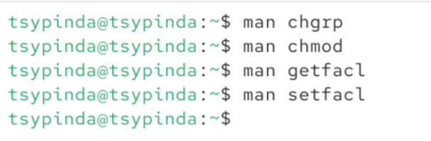{#fig-001 width=90%}

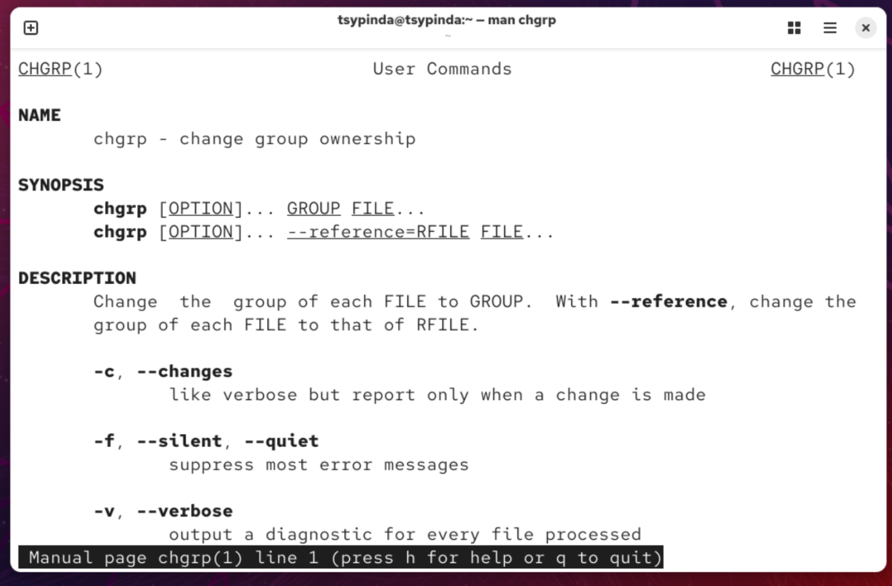{#fig-002 width=90%}

##

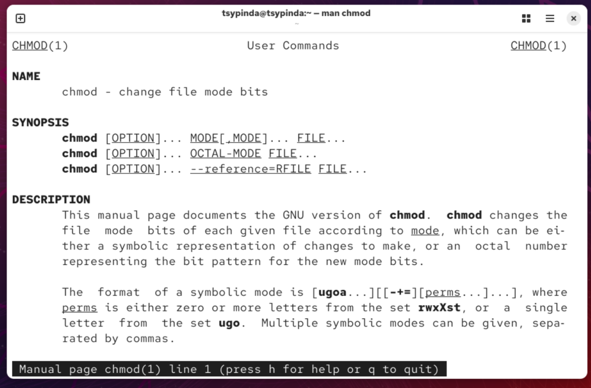{#fig-003 width=90%}

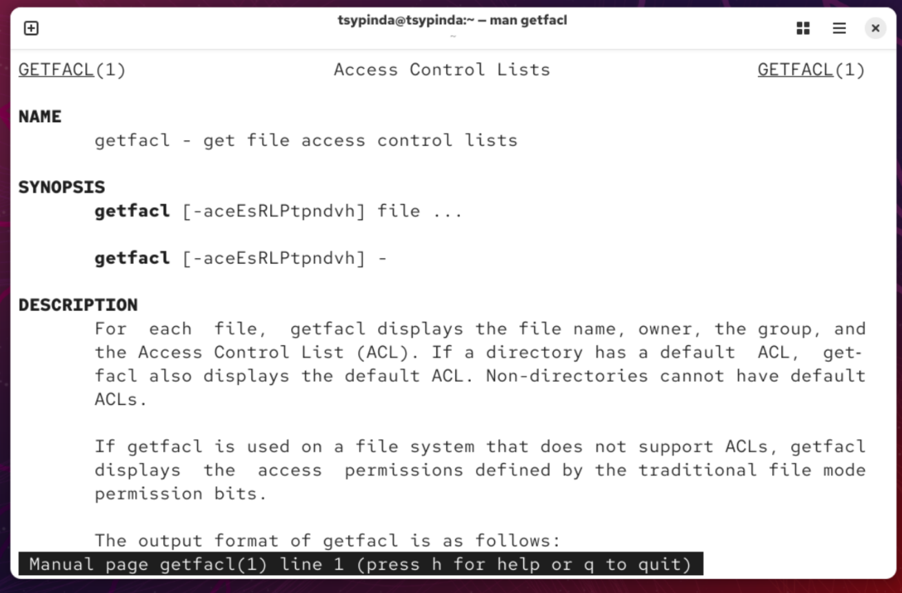{#fig-004 width=90%}

##

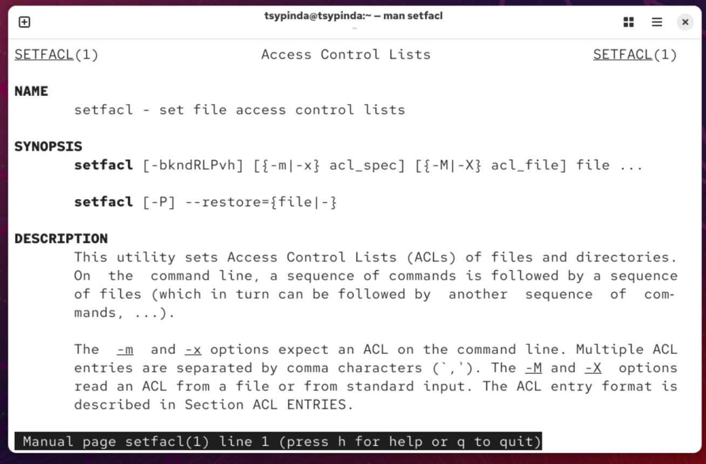{#fig-005 width=90%}

## Задание 2

Переходим в рут и создаем каталоги /data/main и /data/third (рис.6)

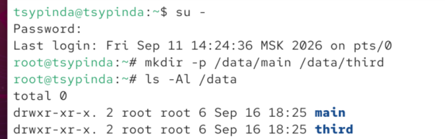{#fig-006 width=90%}

##

Меняем группу директорий /data/main на main и /data/third на third (рис.7)

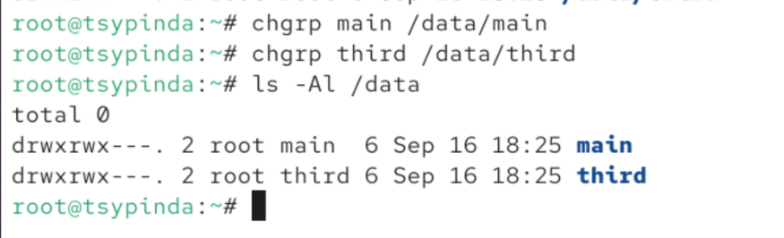{#fig-007 width=90%}

##

Переходим в bob (рис.8)

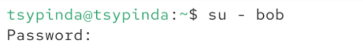{#fig-008 width=90%}

##

Пробуем перейти в каталог /data/main и создать там файл emptyfile. Файл успешно создается (рис.9)

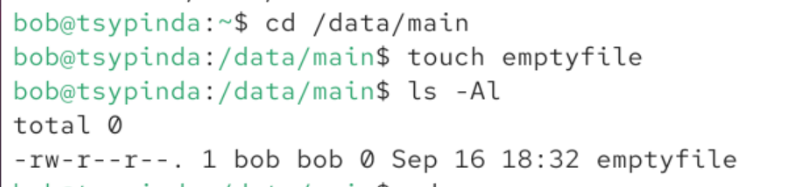{#fig-009 width=90%}

##

Аналогичное пробуем провернуть в директории /data/third, однако получаем отказ "Permission denied" (Отказ в доступе) (рис.10)

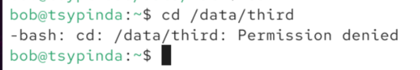{#fig-010 width=90%}

## Задание 3

Переходим в alice, затем в каталог /data/main и создаем файлы alice1 и alice2

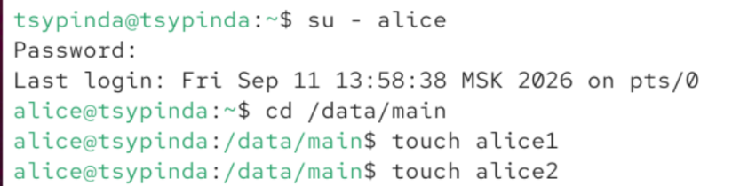{#fig-011 width=90%}

##

Переходим в терминал пользователя bob, переходим в /data/main и просматриваем файлы в директории (рис.12)

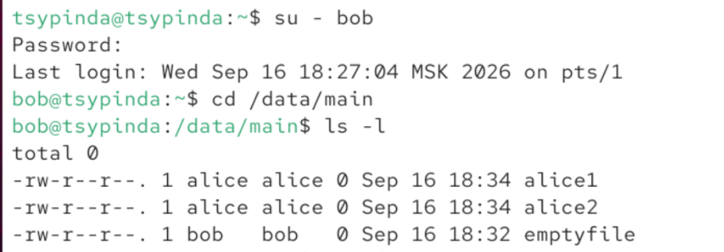{#fig-012 width=90%}

##

От пользователя bob пробуем удалить файлы alice1 и alice2. У нас это получается (рис.13)

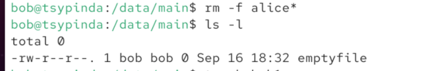{#fig-013 width=90%}

##

Создаем файлы bob1 и bob2 (рис.14)

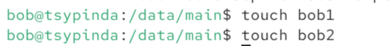{#fig-014 width=90%}

##

Заходим в root и вводим команду chmod g+s,o+t /data/main. Эта команда изменяет права доступа к директории /data/main, устанавливая для неё два специальных флага: SGID (g+s) и Sticky bit (o+t) (рис.15)

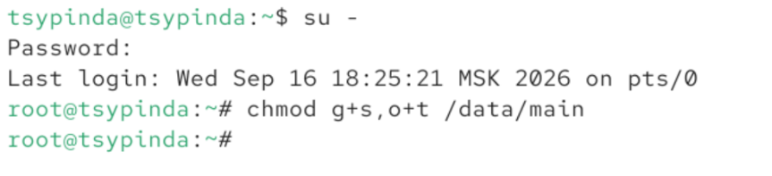{#fig-015 width=90%}

##

В терминале пользователя alice создаем alice3, alice4 и смотрим группу файлов. Группа изменилась на main благодаря предыдущему шагу (рис.16)

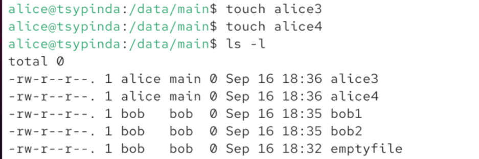{#fig-016 width=90%}

##

Пробуем удалить файлы bob1 и bob2, однако у нас это не получается - недостаточно прав (рис.17).

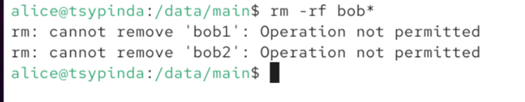{#fig-017 width=90%}

## Задание 4

Заходим в терминал с root (рис.18)

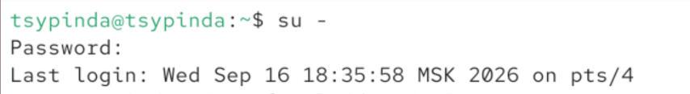{#fig-018 width=90%}

##

Устанавливаем права на чтение и выполнение в каталоге /data/main для группы third
и права на чтение и выполнение для группы main в каталоге /data/third (рис.19)

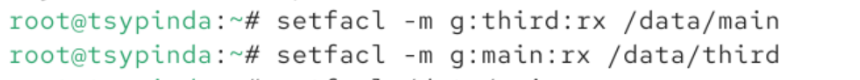{#fig-019 width=90%}

##

Убеждаемся в правильности установки разрешений с помощью getfacl (рис.20, рис.21)

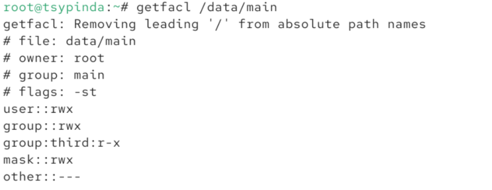{#fig-020 width=90%}

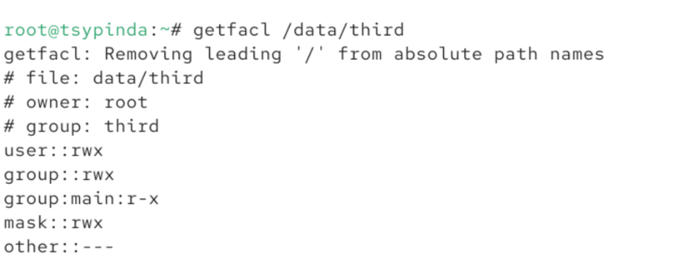{#fig-021 width=90%}

##

Создаем файл newfile1 в /data/main и смотрим его права (рис.22)

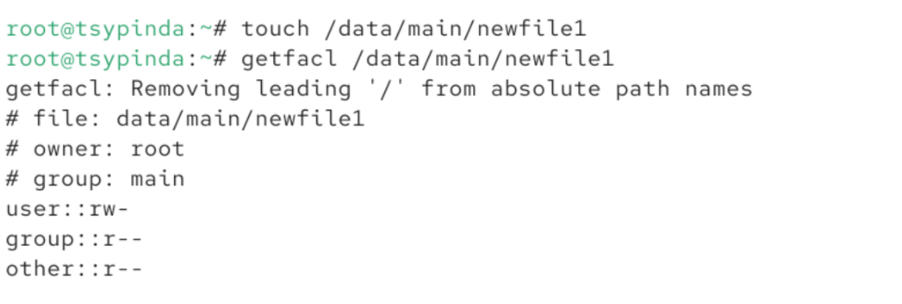{#fig-022 width=90%}

##

Проводим аналогичное в /data/third (рис.23)

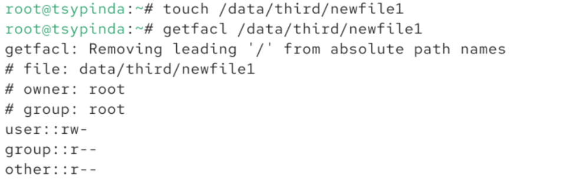{#fig-023 width=90%}

##

Устанавливаем ACL по умолчанию для каталогов /data/main и /data/third. Создаем newfile2 в /data/main и убеждаемся в правильности правах (рис.24)

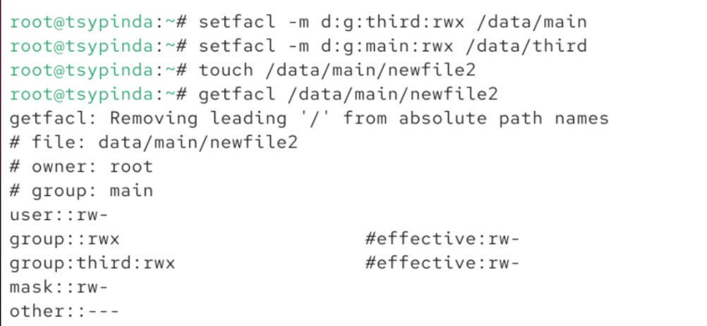{#fig-024 width=90%}

##

Аналогично создаем /data/third/newfile2 и проверяем его права (рис.25)

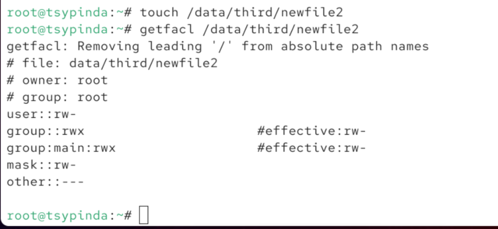{#fig-025 width=90%}

##

Переходим в пользователя carol и пробуем удалить newfile1 и newfile2. У нас не получается - недостаточно прав. Пробуем записать в файл "Hello, world". В первый файл у нас не получается сделать запись, во вторую - получается. Это происходит потому, что newfile1 был создан раньше объявления новых правил (рис.26)

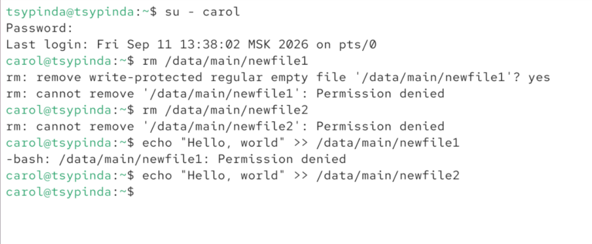{#fig-026 width=90%}

# Выводы

Я получил представление о работе с учётными записями пользователей и группами пользователей в операционной системе типа Linux.

:::
